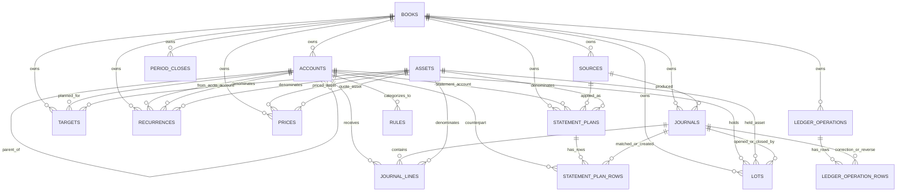

# Clovis SQLite Schema, Explained Simply

This is the Feynman-style version of the Clovis SQLite schema.

The goal is not to memorize table definitions. The goal is to understand the
shape of the data so the raw database stops looking mysterious.

The one-sentence model:

> Clovis stores accounting facts, not balances. A balance is calculated later by
> adding up the facts.

Source of truth:

- Schema constants: [`src/core/schema.ts`](../src/core/schema.ts)
- Ledger storage engine: [`src/core/ledger.ts`](../src/core/ledger.ts)
- Money helpers: [`src/core/money.ts`](../src/core/money.ts)
- Accounting sign helpers: [`src/core/accounting.ts`](../src/core/accounting.ts)
- CLI/MCP tool layer: [`src/app/catalog.ts`](../src/app/catalog.ts)

Current database format:

```ts
export const DEFAULT_BOOK_ID = "book_default";
export const SCHEMA_VERSION = 4;
```

Fresh databases are created directly at schema version 4. Opening a ledger also
migrates older v1/v2/v3 files forward, records each migration in
`migration_history`, and creates the default `Actual` book if it is missing.

## Start Here

Imagine a paper bookkeeping notebook.

Every transaction gets one header:

```text
2026-06-10  Lunch  posted
```

Then the transaction gets lines:

```text
Checking     CAD   -1200
Dining Out   CAD   +1200
```

That is the database.

The header is a row in `journals`.

The lines are rows in `journal_lines`.

The account names come from `accounts`.

The currency/unit comes from `assets`.

The transaction is valid because the lines add to zero:

```text
-1200 + 1200 = 0
```

Clovis does not store "Checking has $500" as a permanent balance row. It stores
every fact that changed Checking. When you ask for the Checking balance, Clovis
sums the relevant finalized `journal_lines`.

## The Tiny Core

If you understand this diagram, you understand the heart of the database:

```text
journals
  |
  | one transaction has many lines
  v
journal_lines
  |              |
  | belongs to   | measured in
  v              v
accounts       assets
```

In plain English:

| Table | What it means |
| --- | --- |
| `journals` | The transaction header: date, description, status. |
| `journal_lines` | The legs of the transaction: account, asset, quantity. |
| `accounts` | The buckets: Checking, Credit Card, Salary, Groceries. |
| `assets` | The units: CAD, USD, MSFT shares, custom units. |

Everything else supports that center.

## The Whole ERD

This is the useful mental picture:

```text
books
  |-- accounts -------.
  |-- journals --.    |
  |              v    v
  |         journal_lines --- assets
  |
  |-- sources ------- journals
  |-- prices -------- assets
  |-- targets ------- accounts + assets
  |-- recurrences --- accounts + assets
  |-- period_closes
  |-- lots ---------- accounts + assets + journals
  |-- statement_plans ---- statement_plan_rows
          |                    |
          |                    `-- journals + accounts
          `-- sources
  `-- ledger_operations ---- ledger_operation_rows
          |                    `-- journals

annotations can point at many entity types
rules point at accounts
meta stands alone
```

Same idea as a Mermaid ERD:



The schema has nineteen application tables:

| Family | Tables | Job |
| --- | --- | --- |
| Identity | `meta`, `migration_history`, `books` | Say what database this is, how it was upgraded, and which book rows belong to. |
| Accounting core | `assets`, `accounts`, `journals`, `journal_lines` | Store durable accounting facts. |
| Workflow memory | `sources`, `statement_plans`, `statement_plan_rows`, `annotations`, `rules` | Remember imports, reconciliation plans, tags, and categorization rules. |
| Operation audit | `ledger_operations`, `ledger_operation_rows` | Record applied mutations, structured diffs, and reversal links. |
| Planning and control | `targets`, `recurrences`, `period_closes` | Store budgets, goals, schedules, and closed periods. |
| Valuation and investments | `prices`, `lots` | Convert assets and track investment cost basis. |

## The Most Important Rule

Every transaction must balance per asset.

That means this is valid:

```text
Checking     CAD   -1200
Dining Out   CAD   +1200
```

CAD sums to zero.

This is also valid:

```text
Checking      CAD   -10000
FX Clearing   CAD   +10000
FX Clearing   USD   -7300
Brokerage     USD   +7300
```

CAD sums to zero. USD sums to zero.

This is not valid:

```text
Checking     CAD   -1200
Dining Out   CAD   +1100
```

CAD sums to `-100`, so something disappeared. Clovis rejects that before it is
written.

SQLite enforces foreign keys, simple checks, and finalization triggers. The
TypeScript engine enforces the same rules before it writes, so normal API calls
get clear errors before SQLite has to reject anything.

## Why Money Is Stored As Integers

SQLite does not have a true fixed-precision money type.

So Clovis does not store `12.34` as a floating point number. It stores `1234`.

The asset tells Clovis how many decimal places to use:

| Asset | Scale | Human value | Stored value |
| --- | ---: | ---: | ---: |
| CAD | `2` | `12.34` | `1234` |
| JPY | `0` | `500` | `500` |
| MSFT shares | `8` | `1.25` | `125000000` |

This is why the database can add money exactly. No floating point drift. No
rounding surprise when summing many rows.

## Table Tour

This section walks through every table in the schema.

The pattern is:

- what the table is
- how to think about it
- what it connects to
- the important columns

The exact SQL is at the bottom in [Full Canonical DDL](#full-canonical-ddl).

## `meta`

Think of `meta` as a label stuck to the database file.

It stores tiny database-level facts.

Current important row:

```text
key = schema_version
value = 3
```

Columns:

| Column | Meaning |
| --- | --- |
| `key` | Metadata name. Primary key. |
| `value` | Metadata value, stored as text. |

Why it exists:

The code can open a database and ask, "What format is this file?" Right now the
answer is schema version 4.

## `migration_history`

Think of `migration_history` as the upgrade receipt.

When Clovis opens an older database and changes its shape, it records which
migration ran and when.

Columns:

| Column | Meaning |
| --- | --- |
| `version` | Schema version that was applied. Primary key. |
| `name` | Short migration name. |
| `applied_at` | Timestamp when the migration ran. |

Why it exists:

`meta.schema_version` says where the file is now. `migration_history` says how
it got there. That is useful when debugging old local ledgers years later.

## `books`

Think of a book as a ledger container.

The default book is:

```text
id = book_default
name = Actual
type = actual
```

Most real data belongs to this default book.

Columns:

| Column | Meaning |
| --- | --- |
| `id` | Book ID. |
| `name` | Human name. Unique. |
| `type` | Either `actual` or `scenario`. |
| `parent_id` | Optional parent book. |
| `created_at` | Creation timestamp. |
| `closed_at` | Scenario close/discard timestamp. |

Connects to:

- `accounts`
- `sources`
- `journals`
- `prices`
- `annotations`
- `rules`
- `targets`
- `recurrences`
- `period_closes`
- `lots`
- `statement_plans`

Why it exists:

The default book is the real ledger. A scenario book is a copied ledger used for
what-if work.

When Clovis creates a scenario, it clones the current book into a new book:

- accounts, transactions, sources, prices, budgets, goals, schedules, closes,
  lots, rules, and annotations get new IDs in the scenario book
- assets stay global, because `USD` or `MSFT` means the same unit everywhere
- later writes to the scenario do not change the default book

That is why nearly every table has `book_id`.

## `assets`

Assets are the units used by transactions.

Examples:

```text
CAD
USD
JPY
MSFT
```

An asset is not always money. A stock share is also an asset. A custom unit can
also be an asset.

Columns:

| Column | Meaning |
| --- | --- |
| `id` | Asset ID. |
| `symbol` | Unique uppercase symbol, like `CAD` or `MSFT`. |
| `type` | `currency`, `commodity`, `custom`, or `security`. |
| `scale` | Decimal places used for integer storage. |
| `name` | Human name. |

Connects to:

- `journal_lines.asset_id`
- `prices.asset_id`
- `prices.quote_asset_id`
- `targets.asset_id`
- `recurrences.asset_id`
- `lots.asset_id`
- `lots.cost_asset_id`

Why it exists:

Clovis refuses to guess a global currency. Every amount is measured in an asset.
That is what lets one ledger hold CAD, USD, securities, and custom units without
mixing them up.

## `accounts`

Accounts are the buckets.

Examples:

```text
Checking
Savings
Credit Card
Salary
Groceries
Dining Out
Opening Balances
```

Columns:

| Column | Meaning |
| --- | --- |
| `id` | Account ID. |
| `book_id` | Owning book. |
| `name` | Account name, unique inside the book. |
| `type` | `asset`, `liability`, `equity`, `income`, or `expense`. |
| `parent_id` | Optional parent account. |
| `default_asset_id` | Optional default asset/currency for tools that need an asset. |
| `code` | Optional chart-of-accounts code. |
| `color_hex` | Display color. |
| `status` | Lifecycle marker, default `active`. |

Connects to:

- `journal_lines.account_id`
- `targets.account_id`
- `recurrences.from_account_id`
- `recurrences.to_account_id`
- `rules.account_id`
- `lots.account_id`

Why it exists:

Every line needs to say which bucket changed.

Account type matters because it tells reports how to present the value:

| Type | Normal side | Statement |
| --- | --- | --- |
| `asset` | debit | balance sheet |
| `expense` | debit | income statement |
| `liability` | credit | balance sheet |
| `equity` | credit | balance sheet |
| `income` | credit | income statement |

Default currency is a column now:

```text
accounts.default_asset_id = <asset id>
```

Older v1 ledgers stored this as an account annotation with
`key = default_asset`. The v2 migration copies that tag into
`accounts.default_asset_id`. The app still reads old tags as a fallback, but new
writes use the column.

## `journals`

`journals` are transaction headers.

One row says:

```text
There was a transaction on this date, with this description, in this state.
```

Example:

```text
id = tx_abc
date = 2026-06-10
status = posted
description = Lunch
```

Columns:

| Column | Meaning |
| --- | --- |
| `id` | Transaction ID. |
| `book_id` | Owning book. |
| `source_id` | Optional import/source batch. |
| `date` | Economic date, `YYYY-MM-DD`. |
| `posted_at` | Time the row was inserted. |
| `finalized_at` | Time the journal became part of the public ledger. Null means draft. |
| `status` | `posted`, `pending`, `planned`, or `void`. |
| `description` | Payee/memo text. |
| `external_id` | Optional external source row ID. |

Connects to:

- `journal_lines.journal_id`
- `sources.id`
- `lots.opened_journal_id`
- `lots.closed_journal_id`

Status meaning:

| Status | Meaning |
| --- | --- |
| `posted` | Accepted transaction. Most reports default to this. |
| `pending` | Imported or staged, waiting for review. |
| `planned` | Future/forecast transaction. |
| `void` | Soft-deleted but retained for history. |

Why it exists:

The header keeps transaction-level facts separate from accounting lines. This
lets one transaction have two lines, four lines, or many lines.

The important v2 idea:

```text
draft journal = header and lines may still be edited
finalized journal = visible accounting fact
```

Normal Clovis writes insert the journal as a draft, insert the lines, then set
`finalized_at`. Reports and list APIs ignore draft journals.

## `journal_lines`

`journal_lines` are the actual accounting facts.

Each row says:

```text
This account changed by this quantity of this asset.
```

Example:

```text
journal_id = tx_abc
account_id = Checking
asset_id = CAD
quantity = -1200
```

Columns:

| Column | Meaning |
| --- | --- |
| `id` | Line ID. |
| `book_id` | Owning book. |
| `journal_id` | Parent transaction. |
| `line_no` | 1-based order within the transaction. |
| `account_id` | Account that changed. |
| `asset_id` | Unit/currency of the quantity. |
| `quantity` | Signed integer atomic units. |
| `memo` | Optional line memo. |

Connects to:

- `journals`
- `accounts`
- `assets`

Why it exists:

This is the fact table. If you want a balance, report, register, trial balance,
or income statement, the answer begins by summing `journal_lines`.

Important detail:

Hard-deleting a journal deletes its lines through `ON DELETE CASCADE`. Voiding a
journal does not delete its lines. It only changes `journals.status`.

## `sources`

Sources remember where transactions came from.

The most common source is an import batch.

Example:

```text
id = batch_abc
type = import
label = June card QFX
status = open
metadata_json = {"statement_type":"credit_card"}
```

Columns:

| Column | Meaning |
| --- | --- |
| `id` | Source ID. Import batches usually use `batch_...`. |
| `book_id` | Owning book. |
| `type` | Source type, often `import`. |
| `label` | Human label. |
| `status` | Workflow status. |
| `created_at` | Creation timestamp. |
| `metadata_json` | JSON metadata string. |

Connects to:

- `journals.source_id`
- transaction annotations like `import_batch`

Why it exists:

Imports are workflows, not just transactions. You may want to commit, roll back,
or inspect an import batch. `sources` gives that workflow a durable identity.

## `statement_plans`

Think of a statement plan as a locked worksheet.

The bank statement says, "Here are the rows I believe happened." The ledger
says, "Here are the rows I already know." A statement plan stores the comparison
before Clovis writes anything new.

Example:

```text
id = stmtplan_abc
account_id = Visa
status = planned
expected_balance = -125000
planned_balance = -125000
file_sha256 = ...
```

Columns:

| Column | Meaning |
| --- | --- |
| `id` | Statement plan ID. |
| `book_id` | Owning book. |
| `account_id` | Statement account being reconciled. |
| `asset_id` | Currency/unit for the plan. |
| `source_id` | Import batch/source created when the plan is applied. |
| `status` | `planned`, `applied`, or `discarded`. |
| `statement_kind` | File/workflow kind, such as bank, card, QFX, or CSV. |
| `file_name` | Source filename, not the full local path. |
| `file_sha256` | Hash of the source file content. |
| `expected_balance` | Optional outside balance supplied by the statement. |
| `planned_balance` | Ledger balance after applying the plan. |
| `applied_balance` | Actual balance recorded after apply. |
| `created_at` | Plan creation timestamp. |
| `applied_at` | Apply timestamp, null until applied. |
| `discarded_at` | Discard timestamp, null unless discarded. |
| `metadata_json` | JSON options used to build the plan. |

Connects to:

- `accounts`
- `assets`
- `sources`
- `statement_plan_rows`

Why it exists:

Imports should be plan-first. A durable plan lets Clovis show exact matches,
pending rows that will become posted, stale pending rows that will be voided,
true new rows, ambiguous rows, expected balance math, and the later verification
handle.

Important detail:

Statement plans are audit records. SQLite triggers block deletes and block
semantic edits after creation. A plan can move from `planned` to `applied` or
`discarded`, but not back.

## `statement_plan_rows`

Think of statement plan rows as the individual marks on the worksheet.

Each row answers one question:

```text
What should Clovis do with this statement line?
```

Common answers:

| Action | Meaning |
| --- | --- |
| `matched` | A posted ledger transaction already explains the statement row. |
| `pending_to_commit` | A pending ledger transaction matches and should become posted. |
| `new_posted` | The statement row is new and should be posted. |
| `new_pending` | A fresh pending row should be recorded for later review. |
| `stale_pending_to_void` | A pending row is no longer on the refreshed statement. |
| `ambiguous` | Clovis found no safe automatic answer. |
| `ignored` | The row is intentionally not applied. |

Columns:

| Column | Meaning |
| --- | --- |
| `id` | Plan row ID. |
| `book_id` | Owning book. |
| `plan_id` | Parent statement plan. |
| `row_index` | Source-row order inside the plan. |
| `date` | Statement row date. |
| `quantity` | Signed atomic quantity from the statement account's view. |
| `description` | Statement row description. |
| `external_id` | Stable statement ID such as QFX/OFX `FITID`, if present. |
| `row_hash` | Hash of the normalized source row. |
| `action` | Planned action. |
| `matched_journal_id` | Existing journal used by `matched`, `pending_to_commit`, or stale-pending actions. |
| `created_journal_id` | Journal created when the row is applied. |
| `counterpart_account_id` | Other side of a new transaction, if needed. |
| `reason` | Human-readable reason for the action. |
| `metadata_json` | Source amount, tags, and parser context. |

Connects to:

- `statement_plans`
- `journals`
- `accounts`

Why it exists:

Without this table, a dry run is just a promise. With this table, the dry run
becomes durable: the exact rows reviewed are the exact rows applied.

Important detail:

`row_hash` is indexed but not unique. Real bank statements can contain two
identical same-day charges. Clovis uses `(plan_id, row_index)` for one-row-one-
decision identity instead of pretending identical charges cannot happen.

## `prices`

Prices tell Clovis how to convert one asset into another.

Example:

```text
1 USD = 1.36 CAD
```

That could be stored as:

```text
asset_id = USD
quote_asset_id = CAD
rate_value = 136
rate_scale = 2
```

Columns:

| Column | Meaning |
| --- | --- |
| `id` | Price ID. |
| `book_id` | Owning book. |
| `asset_id` | Asset being priced. |
| `quote_asset_id` | Asset used as the quote. |
| `rate_value` | Positive integer rate coefficient. |
| `rate_scale` | Decimal places for `rate_value`. |
| `time` | Effective date/time. |

Connects to:

- two `assets` rows: source asset and quote asset

Why it exists:

Storage does not mix assets. CAD, USD, and shares stay separate in
`journal_lines`. Reports use `prices` when they need to value everything in one
quote asset.

If Clovis cannot find a conversion path, reports return `valuation_complete:
false` with `missing_conversions`. They do not silently guess.

## `annotations`

Annotations are sticky notes.

They can attach small pieces of metadata to different kinds of entities.

Examples:

```text
account default currency
transaction import batch
transaction branch tag
transfer matched/unmatched marker
recategorization batch marker
book merged_at marker
```

Columns:

| Column | Meaning |
| --- | --- |
| `id` | Annotation ID. |
| `book_id` | Owning book. |
| `entity_type` | What kind of thing is tagged: `account`, `tx`, `book`, etc. |
| `entity_id` | ID of the thing being tagged. |
| `key` | Tag key. |
| `value` | Tag value. |

Connects to:

- many entity types by convention

Why it exists:

Some facts are useful but not important enough to become permanent columns.
Annotations let Clovis add metadata without changing the schema every time.

Tradeoff:

Because annotations can point at many table types, SQLite cannot enforce every
`entity_id` with a normal foreign key. `integrityCheck()` detects orphan
annotations.

## `rules`

Rules help categorize transactions.

Example:

```text
If description contains "Loblaws", use Groceries.
```

Columns:

| Column | Meaning |
| --- | --- |
| `id` | Rule ID. |
| `book_id` | Owning book. |
| `type` | Rule kind, commonly `match`. |
| `account_id` | Target account. |
| `pattern` | Text pattern to match. |
| `priority` | Evaluation order. |
| `status` | `active` or soft-deleted state. |
| `created_at` | Creation timestamp. |

Connects to:

- `accounts`

Why it exists:

Rules are workflow memory. They do not change the core transaction model. They
help app tools decide how to recategorize or import transactions.

## `targets`

Targets store budgets and goals.

They share one table because both mean:

```text
This account has a planned quantity of this asset.
```

Budget example:

```text
Groceries should spend 60000 CAD atomic units monthly.
```

Goal example:

```text
Savings should reach 500000 CAD atomic units.
```

Columns:

| Column | Meaning |
| --- | --- |
| `id` | Target ID. |
| `book_id` | Owning book. |
| `type` | `budget` or `goal`. |
| `account_id` | Account being planned for. |
| `asset_id` | Unit/currency. |
| `quantity` | Budget or goal amount in atomic units. |
| `period` | `monthly`, `yearly`, or null. Mostly for budgets. |
| `year` | Optional budget year. |
| `month` | Optional budget month. |
| `rollover_rule` | Budget rollover marker. |
| `name` | Goal name. |
| `target_date` | Goal date. |
| `priority` | Goal ordering. |
| `status` | Lifecycle marker. |

Connects to:

- `accounts`
- `assets`

Why it exists:

Budgets and goals are planning data. They should not pollute transaction rows.
A budget is not a transaction. It is a target that reports compare against
actual `journal_lines`.

Important uniqueness rules:

- One budget per book/account/asset/period/year/month.
- One goal per book/account/asset.

## `recurrences`

Recurrences are scheduled transaction templates.

Example:

```text
Every month, move 2500 CAD from Checking to Rent.
```

Columns:

| Column | Meaning |
| --- | --- |
| `id` | Recurrence ID. |
| `book_id` | Owning book. |
| `next_date` | Next scheduled date. |
| `quantity` | Positive atomic amount. |
| `from_account_id` | Source account. |
| `to_account_id` | Destination account. |
| `description` | Transaction description. |
| `frequency` | `daily`, `weekly`, `monthly`, or `yearly`. |
| `end_date` | Optional end date. |
| `asset_id` | Unit/currency. |
| `status` | `active`, `paused`, or `deleted`. |

Connects to:

- `accounts`
- `assets`

Why it exists:

A recurring bill is not itself a posted transaction. It is a recipe for creating
future transactions. When `process_scheduled` runs, it creates normal
`journals` and `journal_lines`, then advances `next_date`.

Current detail:

`end_date` is validated and stored. In the current implementation,
`process_scheduled` does not use it as a stop condition.

## `period_closes`

Period closes are locks on old accounting periods.

Example:

```text
June 2026 is closed through 2026-06-30.
```

Columns:

| Column | Meaning |
| --- | --- |
| `id` | Period close ID. |
| `book_id` | Owning book. |
| `name` | Human checkpoint name. |
| `as_of` | Closed-through date. |
| `description` | Optional note. |
| `created_at` | Creation timestamp. |
| `reopened_at` | Reopen timestamp, null while still closed. |

Connects to:

- `books`

Why it exists:

Once a period is reconciled, you do not want a later import or edit quietly
changing old numbers. Before mutating a transaction, the engine checks whether
the transaction date is inside a still-closed period.

Reopening does not delete the close row. It sets `reopened_at`, preserving the
history.

## `lots`

Lots track investment cost basis.

When you buy a security, you need to remember:

```text
what you bought
how many units
what it cost
which transaction opened the lot
whether the lot is still open
```

Columns:

| Column | Meaning |
| --- | --- |
| `id` | Lot ID. |
| `book_id` | Owning book. |
| `account_id` | Holding account. |
| `asset_id` | Held asset/security. |
| `quantity` | Positive held quantity. |
| `cost_asset_id` | Asset used to measure cost. |
| `cost_quantity` | Positive cost amount. |
| `opened_journal_id` | Transaction that opened the lot. |
| `closed_journal_id` | Transaction that closed the lot, if any. |
| `opened_at` | Open date. |
| `closed_at` | Close date. |
| `status` | `open` or `closed`. |
| `metadata_json` | JSON metadata string. |

Connects to:

- `accounts`
- `assets`
- `journals`

Why it exists:

Investment accounting has extra memory beyond simple cash movement. The journal
records the accounting facts. The lot remembers cost basis and lifecycle.

The engine blocks generic mutations that would break linked lots.

## How Writes Work

The database is not edited randomly. Most writes flow through the `Ledger`
engine.

## Opening A Ledger

When code opens a ledger:

1. Resolve the path. If the path is a directory, use `clovis.db` inside it.
2. Create the parent directory.
3. Open SQLite with `readBigInts: true`.
4. Enable foreign keys.
5. Detect the current schema version.
6. If the file is older than v3, run each needed migration in order.
7. Execute the schema DDL.
8. Insert `schema_version = 3` if missing.
9. Insert the default `Actual` book if missing.

That means opening a new file creates a usable empty ledger. Opening an existing
file is idempotent.

## Creating A Transaction

The transaction write path is:

1. Validate the date.
2. Check the date is not inside a closed period.
3. Validate the status.
4. Convert quantities to `bigint`.
5. Check every quantity fits SQLite's signed integer range.
6. Require lines to balance per asset.
7. Check referenced accounts and assets exist.
8. Start `BEGIN IMMEDIATE`.
9. Insert one draft `journals` row.
10. Insert all `journal_lines`.
11. Set `journals.finalized_at`.
12. Commit, or roll back on error.

The important lesson:

```text
One transaction write is all-or-nothing.
```

You should not end up with a journal header but only half its lines. If you are
writing direct SQL, use the same pattern: insert a draft journal, insert lines,
then finalize.

## Importing Transactions

Imports do not create a separate kind of transaction.

When rows are actually written, they become normal `journals` and
`journal_lines`, then receive source metadata. Before that write, statement
workflows should create a plan.

When a bank offers QFX or OFX, prefer that over CSV because those files usually
carry a bank-provided transaction id such as `FITID`. Clovis keeps that id on
the imported transaction metadata. CSV is still supported and is the practical
fallback when QFX/OFX is unavailable, incomplete, or malformed.

Plan-first import flow:

1. Parse QFX, OFX, or CSV statement rows.
2. Resolve the statement account, counterpart accounts, and asset.
3. Turn each amount into a signed quantity from the statement account's point of
   view.
4. Compare each row with posted and pending ledger history.
5. Preview decisions without writing; when staged with `dry_run:false`, store a
   `statement_plans` row and one `statement_plan_rows` decision per source row.
6. Refuse to apply while any row is ambiguous.
7. Apply the exact reviewed plan: commit matched pending rows, void stale
   pending rows, and write only true new rows.
8. Create a `sources` batch and link created/committed transactions.
9. Verify the plan against the final ledger state.

Direct imports still create normal transactions, but the safest statement
workflow is:

```text
preview -> plan_id -> apply(plan_id) -> verify(plan_id)
```

This is why imported transactions can later be committed, voided,
recategorized, exported, or reported exactly like manually entered
transactions, while the statement plan still explains why they were created.

## Reading Balances

A balance is a sum.

Conceptually:

```sql
SELECT sum(quantity)
FROM journal_lines
JOIN journals
  ON journals.book_id = journal_lines.book_id
 AND journals.id = journal_lines.journal_id
WHERE journal_lines.book_id = ?
  AND journals.finalized_at IS NOT NULL
  AND account_id = ?
  AND asset_id = ?
  AND status = 'posted';
```

The real code adds date filters, status options, rollups, and account-tree
logic, but the core idea is still this:

```text
balance = sum of matching line quantities
```

## Converting Assets

Storage never adds CAD and USD together.

Reports can convert them when you ask for a quote asset.

Example:

```text
Report net worth in CAD.
```

Clovis:

1. Sums raw balances per asset.
2. Finds prices at or before the report date.
3. Converts each asset into CAD.
4. Returns missing conversion warnings if any path is unavailable.

That keeps storage honest and makes reporting explicit.

## Backups

Backups use SQLite's own copy mechanism:

```sql
VACUUM INTO ?
```

By default, backups go into a `backups` folder next to the ledger database.

## File Access For Imports And Exports

File access is not stored in SQLite.

Think of it as normal process I/O:

```text
ledger.db can say what happened
the operating system decides which files the process may read or write
```

Clovis does not maintain a table of trusted folders.

File tools still enforce practical format constraints:

- import tools only accept expected suffixes such as `.csv`, `.qfx`, `.ofx`, or
  `.json`
- export tools refuse to overwrite an existing file
- `CLOVIS_MAX_FILE_BYTES` limits input size
- relative paths are resolved beside the ledger first, then from the current
  working directory for reads
- `CLOVIS_FILE_POLICY=unrestricted` is the default
- `CLOVIS_FILE_POLICY=ledger-dir` restricts file tools to the ledger directory
- `CLOVIS_FILE_POLICY=roots` with `CLOVIS_FILE_ROOTS=/path/a:/path/b` restricts
  file tools to configured roots

The important idea:

```text
The database stores finance facts.
The process policy or sandbox controls filesystem boundaries.
```

Agents can call `file_access_status` or read `tool_registry.file_access` to see
the active policy, allowed roots, and max file size. For a hard boundary, use
Clovis file policy, operating-system permissions, a container, a separate user
account, or the agent runtime's sandbox.

## What SQLite Enforces Vs What The Engine Enforces

SQLite is good at simple durable facts:

| SQLite enforces | Example |
| --- | --- |
| Primary keys | Every row has a stable ID. |
| Foreign keys | A line must point at an existing journal/account/asset. |
| Simple enums | Journal status must be `posted`, `pending`, `planned`, or `void`. |
| Simple sign checks | Price rates and lot quantities must be positive. |
| Cascade deletes | Deleting a journal deletes its lines. |
| Target uniqueness | Duplicate budget/goal rows are blocked by indexes. |
| Finalized journal immutability | Lines cannot be inserted, updated, or deleted after finalization. |
| Finalized journal balancing | A journal cannot be finalized unless its lines balance per asset. |
| Closed-period protection | A journal cannot be finalized or reopened inside an active closed period. |
| Statement plan immutability | Planned statement rows cannot be semantically edited or deleted after review. |

The engine is good at accounting policy:

| Engine enforces | Why it is not just a SQL column check |
| --- | --- |
| Balanced journal errors | Gives clearer errors before SQLite rejects finalization. |
| Date format | SQLite text dates need application validation. |
| Period-lock workflow | Explains which close blocks a mutation. |
| Account parent cycles | Requires walking the hierarchy. |
| Default asset inference | Requires account defaults and app policy. |
| Lot safety | Requires understanding investment workflows. |
| Import validation | Requires checking a whole document before writing. |
| Missing conversion warnings | Requires graph search through prices. |

This split is intentional.

SQLite keeps the relational skeleton solid. The TypeScript engine keeps the
accounting behavior correct and explainable.

## Why The Schema Looks This Way

## Why `journals` And `journal_lines` Are Separate

Because transactions are not always two lines.

A simple lunch has two lines.

An FX transfer has four lines.

A split transaction might have many lines.

The header/lines design handles all of those with one model.

## Why Balances Are Not Stored

Stored balances go stale.

Facts do not.

If Clovis stored a balance row, every transaction edit would need to update that
balance perfectly. Instead, the durable data is the transaction line history.
Reports calculate balances from that history.

## Why `book_id` Appears Everywhere

Rows belong to books because Clovis supports an actual book and scenario books.
Normal activity uses `book_default`. A scenario is a cloned book with its own
accounts and journals. The shape prevents cross-book references where it
matters, because many foreign keys include both the entity ID and `book_id`.

## Why `annotations` Exist

Not every useful bit of metadata deserves a new column.

Import batch tags are useful. Transfer matching tags are useful.
Recategorization history is useful. Book workflow markers are useful.

Annotations let Clovis store these without turning the schema into a wide table
full of nullable columns.

Account default currency used to live here too. In v2 it is promoted to
`accounts.default_asset_id` because tools need it constantly and it is part of
the account's identity.

## Why There Are Triggers

The database has a few triggers for the facts that must remain true even when a
human or agent writes SQL directly:

- a journal must be inserted as a draft
- a journal cannot be finalized until it has lines
- a finalized journal must balance per asset
- finalized journal lines cannot be edited
- closed periods block finalization and reopening
- lot-linked journals cannot be reopened by generic edits

The engine still owns higher-level behavior: dry runs, import validation,
friendly errors, account cycle checks, report conversion warnings, and
investment-specific workflows.

## Direct SQL Write Protocol

If you write transactions directly, use this exact shape:

```sql
BEGIN IMMEDIATE;

INSERT INTO journals(id, book_id, date, posted_at, status, description)
VALUES ('tx_example', 'book_default', '2026-06-10', '2026-06-10T12:00:00Z', 'posted', 'Lunch');

INSERT INTO journal_lines(id, book_id, journal_id, line_no, account_id, asset_id, quantity)
VALUES
  ('line_1', 'book_default', 'tx_example', 1, 'acct_checking', 'asset_cad', -1200),
  ('line_2', 'book_default', 'tx_example', 2, 'acct_dining', 'asset_cad', 1200);

UPDATE journals
SET finalized_at = '2026-06-10T12:00:01Z'
WHERE book_id = 'book_default'
  AND id = 'tx_example';

COMMIT;
```

The last `UPDATE` is the gate. If the journal has no lines, does not balance, or
falls inside a closed period, SQLite rejects it.

## Integrity Check

`integrityCheck()` asks:

```text
Does the database still make accounting sense?
```

It checks:

| Field | What it catches |
| --- | --- |
| `imbalanced_transactions` | Transactions whose lines do not sum to zero per asset. |
| `account_cycles` | Parent loops in the account tree. |
| `orphan_annotations` | Sticky notes pointing at missing rows. |
| `invalid_default_assets` | Old account default-asset tags pointing at missing assets. |
| `invalid_prices` | Bad price rates or scales. |
| `invalid_targets` | Bad budget/goal signs, periods, months, or dates. |
| `duplicate_budgets` | Duplicate budget identities. |
| `invalid_recurrences` | Bad recurrence quantities, dates, statuses, or frequencies. |
| `invalid_lots` | Broken lot links or open lot totals that do not match balances. |

`repair_integrity` currently repairs orphan annotations and invalid default
asset annotations. When it actually repairs, it creates a backup first unless
backup is explicitly disabled.

## How To Read The Raw Database

If you open the SQLite file manually, start here:

1. Look at `assets` so you know the currencies/units and scales.
2. Look at `accounts` so you know the buckets.
3. Look at `journals` for transaction headers.
4. Look at `journal_lines` for the real accounting facts.
5. Join lines to accounts and assets.

Useful query shape:

```sql
SELECT
  j.date,
  j.status,
  j.description,
  a.name AS account_name,
  ast.symbol AS asset,
  l.quantity
FROM journal_lines l
JOIN journals j
  ON j.book_id = l.book_id
 AND j.id = l.journal_id
JOIN accounts a
  ON a.book_id = l.book_id
 AND a.id = l.account_id
JOIN assets ast ON ast.id = l.asset_id
WHERE l.book_id = 'book_default'
  AND j.finalized_at IS NOT NULL
ORDER BY j.date, j.id, l.line_no;
```

That query is the ledger in human-readable form.

## Full Canonical DDL

This is copied from `src/core/schema.ts` for convenience. If this appendix and
the source ever disagree, the TypeScript source is authoritative.

```sql
CREATE TABLE IF NOT EXISTS meta (
  key TEXT PRIMARY KEY,
  value TEXT NOT NULL
);
CREATE TABLE IF NOT EXISTS migration_history (
  version INTEGER PRIMARY KEY,
  name TEXT NOT NULL,
  applied_at TEXT NOT NULL
);
CREATE TABLE IF NOT EXISTS books (
  id TEXT PRIMARY KEY,
  name TEXT NOT NULL UNIQUE,
  type TEXT NOT NULL CHECK(type IN ('actual', 'scenario')),
  parent_id TEXT REFERENCES books(id),
  created_at TEXT NOT NULL,
  closed_at TEXT
);
CREATE TABLE IF NOT EXISTS assets (
  id TEXT PRIMARY KEY,
  symbol TEXT NOT NULL UNIQUE,
  type TEXT NOT NULL CHECK(type IN ('currency', 'commodity', 'custom', 'security')),
  scale INTEGER NOT NULL CHECK(scale >= 0 AND scale <= 18 AND scale = CAST(scale AS INTEGER)),
  name TEXT NOT NULL DEFAULT ''
);
CREATE TABLE IF NOT EXISTS accounts (
  id TEXT PRIMARY KEY,
  book_id TEXT NOT NULL,
  name TEXT NOT NULL,
  type TEXT NOT NULL CHECK(type IN ('asset', 'liability', 'equity', 'income', 'expense')),
  parent_id TEXT,
  default_asset_id TEXT REFERENCES assets(id),
  code TEXT NOT NULL DEFAULT '',
  color_hex TEXT NOT NULL DEFAULT '#888888',
  status TEXT NOT NULL DEFAULT 'active',
  UNIQUE(id, book_id),
  UNIQUE(book_id, name),
  FOREIGN KEY(book_id) REFERENCES books(id),
  FOREIGN KEY(parent_id, book_id) REFERENCES accounts(id, book_id)
);
CREATE TABLE IF NOT EXISTS sources (
  id TEXT PRIMARY KEY,
  book_id TEXT NOT NULL REFERENCES books(id),
  type TEXT NOT NULL,
  label TEXT NOT NULL DEFAULT '',
  status TEXT NOT NULL DEFAULT 'open',
  created_at TEXT NOT NULL,
  metadata_json TEXT NOT NULL DEFAULT '{}',
  UNIQUE(id, book_id)
);
CREATE TABLE IF NOT EXISTS journals (
  id TEXT PRIMARY KEY,
  book_id TEXT NOT NULL,
  source_id TEXT,
  date TEXT NOT NULL,
  posted_at TEXT NOT NULL,
  finalized_at TEXT,
  status TEXT NOT NULL CHECK(status IN ('posted', 'pending', 'planned', 'void')),
  description TEXT NOT NULL DEFAULT '',
  external_id TEXT,
  UNIQUE(id, book_id),
  FOREIGN KEY(book_id) REFERENCES books(id),
  FOREIGN KEY(source_id, book_id) REFERENCES sources(id, book_id)
);
CREATE INDEX IF NOT EXISTS idx_journals_book_date ON journals(book_id, date, id);
CREATE INDEX IF NOT EXISTS idx_journals_status ON journals(status, date);
CREATE TABLE IF NOT EXISTS journal_lines (
  id TEXT PRIMARY KEY,
  book_id TEXT NOT NULL,
  journal_id TEXT NOT NULL,
  line_no INTEGER NOT NULL,
  account_id TEXT NOT NULL,
  asset_id TEXT NOT NULL REFERENCES assets(id),
  quantity INTEGER NOT NULL,
  memo TEXT NOT NULL DEFAULT '',
  UNIQUE(journal_id, line_no),
  FOREIGN KEY(journal_id, book_id) REFERENCES journals(id, book_id) ON DELETE CASCADE,
  FOREIGN KEY(account_id, book_id) REFERENCES accounts(id, book_id)
);
CREATE INDEX IF NOT EXISTS idx_lines_journal ON journal_lines(journal_id);
CREATE INDEX IF NOT EXISTS idx_lines_account_asset ON journal_lines(account_id, asset_id);
CREATE TABLE IF NOT EXISTS prices (
  id TEXT PRIMARY KEY,
  book_id TEXT NOT NULL REFERENCES books(id),
  asset_id TEXT NOT NULL REFERENCES assets(id),
  quote_asset_id TEXT NOT NULL REFERENCES assets(id),
  rate_value INTEGER NOT NULL CHECK(rate_value > 0),
  rate_scale INTEGER NOT NULL CHECK(rate_scale >= 0 AND rate_scale <= 18 AND rate_scale = CAST(rate_scale AS INTEGER)),
  time TEXT NOT NULL,
  UNIQUE(id, book_id)
);
CREATE INDEX IF NOT EXISTS idx_prices_pair_time ON prices(book_id, asset_id, quote_asset_id, time);
CREATE TABLE IF NOT EXISTS annotations (
  id TEXT PRIMARY KEY,
  book_id TEXT NOT NULL REFERENCES books(id),
  entity_type TEXT NOT NULL,
  entity_id TEXT NOT NULL,
  key TEXT NOT NULL,
  value TEXT NOT NULL
);
CREATE INDEX IF NOT EXISTS idx_annotations_entity ON annotations(entity_type, entity_id, key);
CREATE TABLE IF NOT EXISTS rules (
  id TEXT PRIMARY KEY,
  book_id TEXT NOT NULL,
  type TEXT NOT NULL,
  account_id TEXT,
  pattern TEXT NOT NULL,
  priority INTEGER NOT NULL DEFAULT 100,
  status TEXT NOT NULL DEFAULT 'active',
  created_at TEXT NOT NULL,
  UNIQUE(id, book_id),
  FOREIGN KEY(book_id) REFERENCES books(id),
  FOREIGN KEY(account_id, book_id) REFERENCES accounts(id, book_id)
);
CREATE INDEX IF NOT EXISTS idx_rules_type_status ON rules(type, status, priority);
CREATE TABLE IF NOT EXISTS targets (
  id TEXT PRIMARY KEY,
  book_id TEXT NOT NULL,
  type TEXT NOT NULL CHECK(type IN ('budget', 'goal')),
  account_id TEXT NOT NULL,
  asset_id TEXT NOT NULL REFERENCES assets(id),
  quantity INTEGER NOT NULL CHECK((type = 'budget' AND quantity >= 0) OR (type = 'goal' AND quantity > 0)),
  period TEXT CHECK(period IS NULL OR period IN ('monthly', 'yearly')),
  year INTEGER,
  month INTEGER CHECK(month IS NULL OR (month >= 1 AND month <= 12)),
  rollover_rule TEXT NOT NULL DEFAULT '',
  name TEXT NOT NULL DEFAULT '',
  target_date TEXT,
  priority INTEGER NOT NULL DEFAULT 1,
  status TEXT NOT NULL DEFAULT 'active',
  UNIQUE(id, book_id),
  FOREIGN KEY(book_id) REFERENCES books(id),
  FOREIGN KEY(account_id, book_id) REFERENCES accounts(id, book_id)
);
CREATE UNIQUE INDEX IF NOT EXISTS idx_targets_budget ON targets(book_id, type, account_id, asset_id, period, coalesce(year, -1), coalesce(month, -1))
  WHERE type = 'budget';
CREATE UNIQUE INDEX IF NOT EXISTS idx_targets_goal ON targets(book_id, type, account_id, asset_id)
  WHERE type = 'goal';
CREATE TABLE IF NOT EXISTS recurrences (
  id TEXT PRIMARY KEY,
  book_id TEXT NOT NULL,
  next_date TEXT NOT NULL,
  quantity INTEGER NOT NULL CHECK(quantity > 0),
  from_account_id TEXT NOT NULL,
  to_account_id TEXT NOT NULL,
  description TEXT NOT NULL DEFAULT '',
  frequency TEXT NOT NULL CHECK(frequency IN ('daily', 'weekly', 'monthly', 'yearly')),
  end_date TEXT,
  asset_id TEXT NOT NULL REFERENCES assets(id),
  status TEXT NOT NULL DEFAULT 'active' CHECK(status IN ('active', 'paused', 'deleted')),
  UNIQUE(id, book_id),
  FOREIGN KEY(book_id) REFERENCES books(id),
  FOREIGN KEY(from_account_id, book_id) REFERENCES accounts(id, book_id),
  FOREIGN KEY(to_account_id, book_id) REFERENCES accounts(id, book_id)
);
CREATE TABLE IF NOT EXISTS period_closes (
  id TEXT PRIMARY KEY,
  book_id TEXT NOT NULL REFERENCES books(id),
  name TEXT NOT NULL,
  as_of TEXT NOT NULL,
  description TEXT,
  created_at TEXT NOT NULL,
  reopened_at TEXT,
  UNIQUE(id, book_id)
);
CREATE INDEX IF NOT EXISTS idx_period_closes_book_as_of ON period_closes(book_id, as_of);
CREATE TABLE IF NOT EXISTS lots (
  id TEXT PRIMARY KEY,
  book_id TEXT NOT NULL,
  account_id TEXT NOT NULL,
  asset_id TEXT NOT NULL REFERENCES assets(id),
  quantity INTEGER NOT NULL CHECK(quantity > 0),
  cost_asset_id TEXT NOT NULL REFERENCES assets(id),
  cost_quantity INTEGER NOT NULL CHECK(cost_quantity > 0),
  opened_journal_id TEXT NOT NULL,
  closed_journal_id TEXT,
  opened_at TEXT NOT NULL,
  closed_at TEXT,
  status TEXT NOT NULL DEFAULT 'open' CHECK(status IN ('open', 'closed')),
  metadata_json TEXT NOT NULL DEFAULT '{}',
  UNIQUE(id, book_id),
  FOREIGN KEY(book_id) REFERENCES books(id),
  FOREIGN KEY(account_id, book_id) REFERENCES accounts(id, book_id),
  FOREIGN KEY(opened_journal_id, book_id) REFERENCES journals(id, book_id),
  FOREIGN KEY(closed_journal_id, book_id) REFERENCES journals(id, book_id)
);
CREATE TABLE IF NOT EXISTS statement_plans (
  id TEXT PRIMARY KEY,
  book_id TEXT NOT NULL,
  account_id TEXT NOT NULL,
  asset_id TEXT NOT NULL REFERENCES assets(id),
  source_id TEXT,
  status TEXT NOT NULL DEFAULT 'planned' CHECK(status IN ('planned', 'applied', 'discarded')),
  statement_kind TEXT NOT NULL DEFAULT '',
  file_name TEXT NOT NULL DEFAULT '',
  file_sha256 TEXT NOT NULL DEFAULT '',
  expected_balance INTEGER,
  planned_balance INTEGER NOT NULL,
  applied_balance INTEGER,
  created_at TEXT NOT NULL,
  applied_at TEXT,
  discarded_at TEXT,
  metadata_json TEXT NOT NULL DEFAULT '{}',
  UNIQUE(id, book_id),
  FOREIGN KEY(book_id) REFERENCES books(id),
  FOREIGN KEY(account_id, book_id) REFERENCES accounts(id, book_id),
  FOREIGN KEY(source_id, book_id) REFERENCES sources(id, book_id)
);
CREATE INDEX IF NOT EXISTS idx_statement_plans_account_status ON statement_plans(book_id, account_id, status, created_at);
CREATE TABLE IF NOT EXISTS statement_plan_rows (
  id TEXT PRIMARY KEY,
  book_id TEXT NOT NULL,
  plan_id TEXT NOT NULL,
  row_index INTEGER NOT NULL,
  date TEXT NOT NULL,
  quantity INTEGER NOT NULL,
  description TEXT NOT NULL DEFAULT '',
  external_id TEXT,
  row_hash TEXT NOT NULL,
  action TEXT NOT NULL CHECK(action IN ('matched', 'pending_to_commit', 'new_posted', 'new_pending', 'stale_pending_to_void', 'ambiguous', 'ignored')),
  matched_journal_id TEXT,
  created_journal_id TEXT,
  counterpart_account_id TEXT,
  reason TEXT NOT NULL DEFAULT '',
  metadata_json TEXT NOT NULL DEFAULT '{}',
  UNIQUE(plan_id, row_index),
  FOREIGN KEY(book_id) REFERENCES books(id),
  FOREIGN KEY(plan_id, book_id) REFERENCES statement_plans(id, book_id) ON DELETE CASCADE,
  FOREIGN KEY(matched_journal_id, book_id) REFERENCES journals(id, book_id),
  FOREIGN KEY(created_journal_id, book_id) REFERENCES journals(id, book_id),
  FOREIGN KEY(counterpart_account_id, book_id) REFERENCES accounts(id, book_id)
);
CREATE INDEX IF NOT EXISTS idx_statement_plan_rows_plan_action ON statement_plan_rows(plan_id, action, row_index);
CREATE INDEX IF NOT EXISTS idx_statement_plan_rows_hash ON statement_plan_rows(book_id, row_hash);
CREATE TABLE IF NOT EXISTS ledger_operations (
  id TEXT PRIMARY KEY,
  book_id TEXT NOT NULL,
  tool_name TEXT NOT NULL,
  operation_type TEXT NOT NULL,
  status TEXT NOT NULL DEFAULT 'applied' CHECK(status IN ('applied', 'reversed')),
  created_at TEXT NOT NULL,
  reversed_at TEXT,
  reversed_by_operation_id TEXT,
  reverses_operation_id TEXT,
  input_json TEXT NOT NULL DEFAULT '{}',
  preview_json TEXT NOT NULL DEFAULT '{}',
  result_json TEXT NOT NULL DEFAULT '{}',
  metadata_json TEXT NOT NULL DEFAULT '{}',
  UNIQUE(id, book_id),
  FOREIGN KEY(book_id) REFERENCES books(id),
  FOREIGN KEY(reversed_by_operation_id, book_id) REFERENCES ledger_operations(id, book_id),
  FOREIGN KEY(reverses_operation_id, book_id) REFERENCES ledger_operations(id, book_id)
);
CREATE INDEX IF NOT EXISTS idx_ledger_operations_type_status ON ledger_operations(book_id, operation_type, status, created_at);
CREATE TABLE IF NOT EXISTS ledger_operation_rows (
  id TEXT PRIMARY KEY,
  book_id TEXT NOT NULL,
  operation_id TEXT NOT NULL,
  row_index INTEGER NOT NULL,
  entity_type TEXT NOT NULL,
  entity_id TEXT NOT NULL,
  action TEXT NOT NULL CHECK(action IN ('insert', 'update', 'delete', 'correction', 'reverse')),
  before_hash TEXT,
  after_hash TEXT,
  before_json TEXT,
  after_json TEXT,
  correction_journal_id TEXT,
  reverse_journal_id TEXT,
  metadata_json TEXT NOT NULL DEFAULT '{}',
  UNIQUE(operation_id, row_index),
  FOREIGN KEY(book_id) REFERENCES books(id),
  FOREIGN KEY(operation_id, book_id) REFERENCES ledger_operations(id, book_id) ON DELETE CASCADE,
  FOREIGN KEY(correction_journal_id, book_id) REFERENCES journals(id, book_id),
  FOREIGN KEY(reverse_journal_id, book_id) REFERENCES journals(id, book_id)
);
CREATE INDEX IF NOT EXISTS idx_ledger_operation_rows_operation ON ledger_operation_rows(operation_id, row_index);
CREATE TRIGGER IF NOT EXISTS trg_statement_plans_no_identity_update
BEFORE UPDATE OF book_id, account_id, asset_id, statement_kind, file_name, file_sha256, expected_balance, planned_balance, metadata_json, created_at ON statement_plans
BEGIN
  SELECT RAISE(ABORT, 'statement plan identity is immutable');
END;
CREATE TRIGGER IF NOT EXISTS trg_statement_plans_status_transition
BEFORE UPDATE OF status ON statement_plans
WHEN OLD.status != NEW.status
BEGIN
  SELECT CASE
    WHEN OLD.status != 'planned'
    THEN RAISE(ABORT, 'statement plan status is final')
  END;
  SELECT CASE
    WHEN NEW.status NOT IN ('applied', 'discarded')
    THEN RAISE(ABORT, 'invalid statement plan status transition')
  END;
  SELECT CASE
    WHEN NEW.status = 'applied' AND NEW.applied_at IS NULL
    THEN RAISE(ABORT, 'applied statement plan requires applied_at')
  END;
  SELECT CASE
    WHEN NEW.status = 'discarded' AND NEW.discarded_at IS NULL
    THEN RAISE(ABORT, 'discarded statement plan requires discarded_at')
  END;
END;
CREATE TRIGGER IF NOT EXISTS trg_statement_plans_no_delete
BEFORE DELETE ON statement_plans
BEGIN
  SELECT RAISE(ABORT, 'statement plans are audit records');
END;
CREATE TRIGGER IF NOT EXISTS trg_statement_plan_rows_no_semantic_update
BEFORE UPDATE OF book_id, plan_id, row_index, date, quantity, description, external_id, row_hash, action, matched_journal_id, counterpart_account_id, reason, metadata_json ON statement_plan_rows
BEGIN
  SELECT RAISE(ABORT, 'statement plan rows are immutable');
END;
CREATE TRIGGER IF NOT EXISTS trg_statement_plan_rows_created_once
BEFORE UPDATE OF created_journal_id ON statement_plan_rows
WHEN OLD.created_journal_id IS NOT NULL OR NEW.created_journal_id IS NULL
BEGIN
  SELECT RAISE(ABORT, 'created_journal_id can only be set once');
END;
CREATE TRIGGER IF NOT EXISTS trg_statement_plan_rows_no_delete
BEFORE DELETE ON statement_plan_rows
BEGIN
  SELECT RAISE(ABORT, 'statement plan rows are audit records');
END;
CREATE TRIGGER IF NOT EXISTS trg_ledger_operations_no_identity_update
BEFORE UPDATE OF book_id, tool_name, operation_type, created_at, reverses_operation_id, input_json, preview_json, result_json, metadata_json ON ledger_operations
BEGIN
  SELECT RAISE(ABORT, 'ledger operations are audit records');
END;
CREATE TRIGGER IF NOT EXISTS trg_ledger_operations_status_transition
BEFORE UPDATE OF status ON ledger_operations
WHEN OLD.status != NEW.status
BEGIN
  SELECT CASE
    WHEN OLD.status != 'applied' OR NEW.status != 'reversed'
    THEN RAISE(ABORT, 'invalid ledger operation status transition')
  END;
  SELECT CASE
    WHEN NEW.reversed_at IS NULL OR NEW.reversed_by_operation_id IS NULL
    THEN RAISE(ABORT, 'reversed ledger operation requires reversal metadata')
  END;
END;
CREATE TRIGGER IF NOT EXISTS trg_ledger_operations_no_delete
BEFORE DELETE ON ledger_operations
BEGIN
  SELECT RAISE(ABORT, 'ledger operations are audit records');
END;
CREATE TRIGGER IF NOT EXISTS trg_ledger_operation_rows_no_update
BEFORE UPDATE ON ledger_operation_rows
BEGIN
  SELECT RAISE(ABORT, 'ledger operation rows are immutable');
END;
CREATE TRIGGER IF NOT EXISTS trg_ledger_operation_rows_no_delete
BEFORE DELETE ON ledger_operation_rows
BEGIN
  SELECT RAISE(ABORT, 'ledger operation rows are audit records');
END;
CREATE TRIGGER IF NOT EXISTS trg_journals_no_finalized_insert
BEFORE INSERT ON journals
WHEN NEW.finalized_at IS NOT NULL
BEGIN
  SELECT RAISE(ABORT, 'insert journal as draft, then finalize');
END;
CREATE TRIGGER IF NOT EXISTS trg_journals_finalize_requires_lines
BEFORE UPDATE OF finalized_at ON journals
WHEN OLD.finalized_at IS NULL AND NEW.finalized_at IS NOT NULL
BEGIN
  SELECT CASE
    WHEN NOT EXISTS (
      SELECT 1 FROM journal_lines
      WHERE book_id = NEW.book_id AND journal_id = NEW.id
    )
    THEN RAISE(ABORT, 'finalized journal must have lines')
  END;
  SELECT CASE
    WHEN EXISTS (
      SELECT 1
      FROM (
        SELECT asset_id, sum(quantity) AS total
        FROM journal_lines
        WHERE book_id = NEW.book_id AND journal_id = NEW.id
        GROUP BY asset_id
        HAVING total != 0
      )
    )
    THEN RAISE(ABORT, 'finalized journal must balance per asset')
  END;
  SELECT CASE
    WHEN EXISTS (
      SELECT 1 FROM period_closes
      WHERE book_id = NEW.book_id
        AND reopened_at IS NULL
        AND as_of >= NEW.date
      LIMIT 1
    )
    THEN RAISE(ABORT, 'journal date is in a closed period')
  END;
END;
CREATE TRIGGER IF NOT EXISTS trg_journals_reopen_guard
BEFORE UPDATE OF finalized_at ON journals
WHEN OLD.finalized_at IS NOT NULL AND NEW.finalized_at IS NULL
BEGIN
  SELECT CASE
    WHEN EXISTS (
      SELECT 1 FROM period_closes
      WHERE book_id = OLD.book_id
        AND reopened_at IS NULL
        AND as_of >= OLD.date
      LIMIT 1
    )
    THEN RAISE(ABORT, 'cannot reopen journal in a closed period')
  END;
  SELECT CASE
    WHEN EXISTS (
      SELECT 1 FROM lots
      WHERE book_id = OLD.book_id
        AND (opened_journal_id = OLD.id OR closed_journal_id = OLD.id)
      LIMIT 1
    )
    THEN RAISE(ABORT, 'cannot reopen journal linked to investment lots')
  END;
END;
CREATE TRIGGER IF NOT EXISTS trg_lines_no_insert_finalized
BEFORE INSERT ON journal_lines
WHEN EXISTS (
  SELECT 1 FROM journals
  WHERE book_id = NEW.book_id
    AND id = NEW.journal_id
    AND finalized_at IS NOT NULL
)
BEGIN
  SELECT RAISE(ABORT, 'cannot insert lines on finalized journal');
END;
CREATE TRIGGER IF NOT EXISTS trg_lines_no_update_finalized
BEFORE UPDATE ON journal_lines
WHEN EXISTS (
  SELECT 1 FROM journals
  WHERE book_id = OLD.book_id
    AND id = OLD.journal_id
    AND finalized_at IS NOT NULL
)
BEGIN
  SELECT RAISE(ABORT, 'cannot update lines on finalized journal');
END;
CREATE TRIGGER IF NOT EXISTS trg_lines_no_delete_finalized
BEFORE DELETE ON journal_lines
WHEN EXISTS (
  SELECT 1 FROM journals
  WHERE book_id = OLD.book_id
    AND id = OLD.journal_id
    AND finalized_at IS NOT NULL
)
BEGIN
  SELECT RAISE(ABORT, 'cannot delete lines on finalized journal');
END;
```
